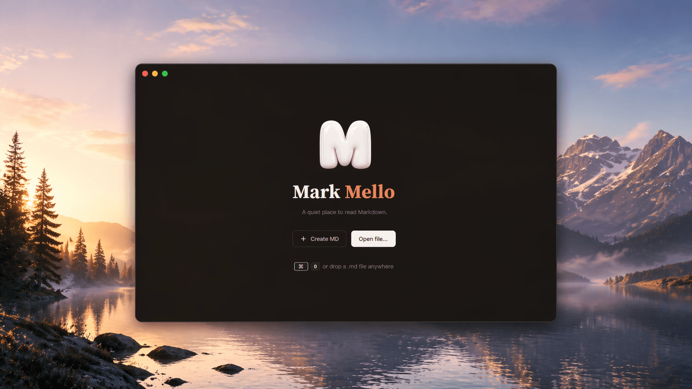

# MarkMello Applicate

[Russian](README.ru.md)

**MarkMello Applicate is a MarkMello fork for quickly reading Markdown files, with improved rendering for technical documents and TeX formulas.**

This repository is a fork of [upstream MarkMello](https://github.com/dartdavros/MarkMello).
The original project belongs to MarkMello contributors. Applicate additions are
maintained separately: Copyright (C) 2026 Dmitry Denisenko (@applicate2628).
See [NOTICE.md](NOTICE.md) and [FORK_CHANGES.md](FORK_CHANGES.md) for details.

## What MarkMello can do

MarkMello Applicate keeps the baseline MarkMello features:

- quickly open Markdown files in reading mode;
- adjust the reading experience: theme, font size, line height, and document width;
- switch to editing mode when needed and make changes to the file.

Applicate additions:

- add an optional WebView/KaTeX renderer for inline and display TeX formulas in Markdown;
- render Markdown locally: documents, generated HTML, KaTeX assets, and temporary WebView files stay on the user's machine, while remote image links in WebView render as placeholders;
- keep the native renderer as a fallback and compatibility mode;
- add flexible reader-width resizing by dragging the content edge while preserving the original Narrow, Medium, and Wide presets;
- add a WebView minimap while preserving the native minimap for the native renderer;
- keep reading, resize, theme, edit preview, and Native/WebView switching synchronized without a blank frame;
- add a tab strip above the document and a multi-document model: several `.md` files can be open at once, click a tab to switch, click `×` to close, drag a tab horizontally to reorder it within the strip;
- remember the open document list and the active tab across launches (`%AppData%/MarkMello/applicate-session.json`);
- accept file drag-and-drop in the window: in reading mode the dropped file opens as a new tab, in editing mode it is inserted at the caret position (images are saved next to the document and inserted as a relative link in the form ``).

## How it differs from regular Markdown editors

MarkMello opens the file for reading first.

Editing is not the primary startup mode: it is enabled manually when you need to make changes.

## Installation

Download the latest build from [Releases](../../releases/latest).

### Windows

1. Download `MarkMello.Applicate-setup-win-x64.exe` or `MarkMello.Applicate-setup-win-arm64.exe`, depending on your computer architecture.
2. Run the installer.
3. Launch MarkMello Applicate from the Start menu or open a `.md` file with MarkMello Applicate.

### Other platforms

MarkMello Applicate is **Windows-only**. The fork's renderer depends on WebView2 (Microsoft Edge Chromium), which has no native equivalent on macOS or Linux. There are no pre-built binaries for other platforms and none are planned in the foreseeable future.

If you need the upstream MarkMello (without WebView2/Applicate additions) on other platforms, [build it from source](#build-from-source). The `MarkMello.Applicate.Desktop` fork project cannot be built on non-Windows.

## Temporary unsigned builds

Current public MarkMello Applicate builds are temporarily distributed without a developer signature. Because of that, Windows may show a warning on first launch.

This is a temporary distribution pipeline limitation. Developer signing will be added in the future.

### Windows: bypass SmartScreen

If Windows shows a SmartScreen warning:

1. Click `More info`.
2. Click `Run anyway`.

If Windows marked the downloaded file as blocked:

1. Open the installer file properties.
2. Enable `Unblock`, if the option is available.
3. Apply the changes and run the installer again.

## Build from source

.NET SDK 10 is required. Node.js/npm is also required when rebuilding the WebView renderer assets.

```bash
dotnet restore ./MarkMello.sln
dotnet build ./MarkMello.sln
```

If the TypeScript renderer changed:

```bash
npm --prefix ./src/MarkMello.Applicate.Desktop install
npm --prefix ./src/MarkMello.Applicate.Desktop run check:renderer
npm --prefix ./src/MarkMello.Applicate.Desktop run build:renderer
```

Run the upstream project:

```bash
dotnet run --project ./src/MarkMello.Desktop/MarkMello.Desktop.csproj
```

Run the Applicate fork:

```bash
dotnet run --project ./src/MarkMello.Applicate.Desktop/MarkMello.Applicate.Desktop.csproj
```

Open a file from the command line:

```bash
dotnet run --project ./src/MarkMello.Applicate.Desktop/MarkMello.Applicate.Desktop.csproj -- ./sample.md
```

Applicate Windows installer build instructions are documented in [packaging/README.md](packaging/README.md).

## Keyboard shortcuts

| Action | Shortcut |
| --- | --- |
| Open file | `Ctrl+O` |
| Toggle editing mode | `Ctrl+E` |
| Save | `Ctrl+S` |
| Save as | `Ctrl+Shift+S` |

## License

The project is distributed under the GPL-3.0 license.

See [LICENSE](LICENSE).

## Terms and Abbreviations

- `Applicate`: fork-specific overlay with formula support and reader improvements.
- `GPL-3.0`: GNU General Public License version 3.
- `Markdown`: lightweight markup format for text documentation.
- `minimap`: side miniature of the document used for quick navigation.
- `renderer path`: Markdown processing path from parser model to UI rendering.
- `TeX`: math notation syntax used by Markdown math renderers.
- `upstream`: the original MarkMello repository this fork is based on.
