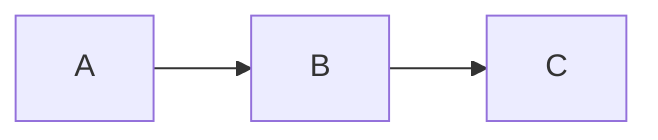
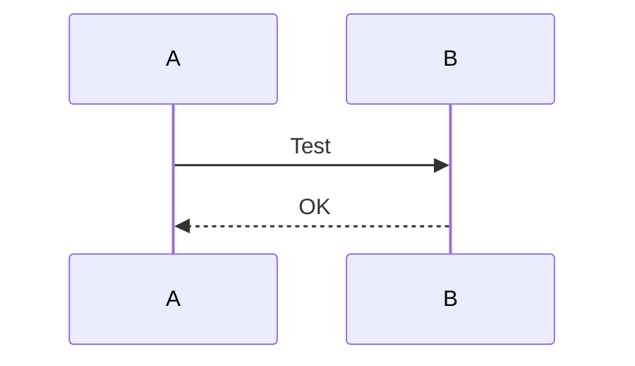

# Broken Mermaid Fallback Test

При невалидном синтаксисе mermaid должен показать **исходный код** как plain `<pre><code>` block (а не пустую дыру).

## Валидная диаграмма (должна рендериться)



## Невалидная диаграмма #1 — синтаксическая ошибка

```mermaid
this is not valid mermaid syntax
random characters here
@@!!@##$$
```

## Невалидная диаграмма #2 — incomplete

```mermaid
flowchart
    NotDefined ->
```

## После broken — снова валидная (проверка что pipeline не сломался)


