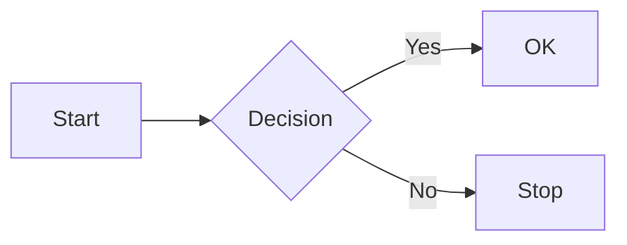
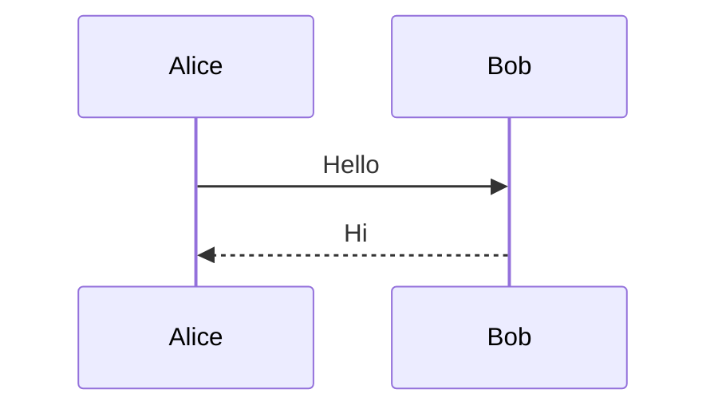

# MarkMello Applicate — Renderer Smoke

Тестовый файл для проверки Applicate-overlay renderer features:
KaTeX-формулы (upstream), Mermaid диаграммы (fork), syntax highlighting (fork).

## Math (existing KaTeX)

Inline: $E = mc^2$ и $\sum_{i=1}^n i = \frac{n(n+1)}{2}$.

Display:

$$
\int_a^b f(x) dx = F(b) - F(a)
$$

## Mermaid diagrams (fork)





## Syntax highlighting (fork)

```javascript
const greeting = "Hello, world!";
console.log(greeting);
```

```python
def greet(name):
    return f"Hello, {name}!"
```

```rust
fn main() {
    println!("Hello, world!");
}
```

```
plain text без language
```
